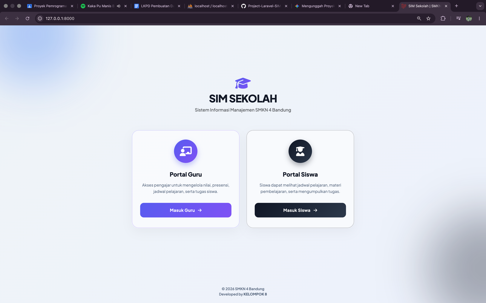
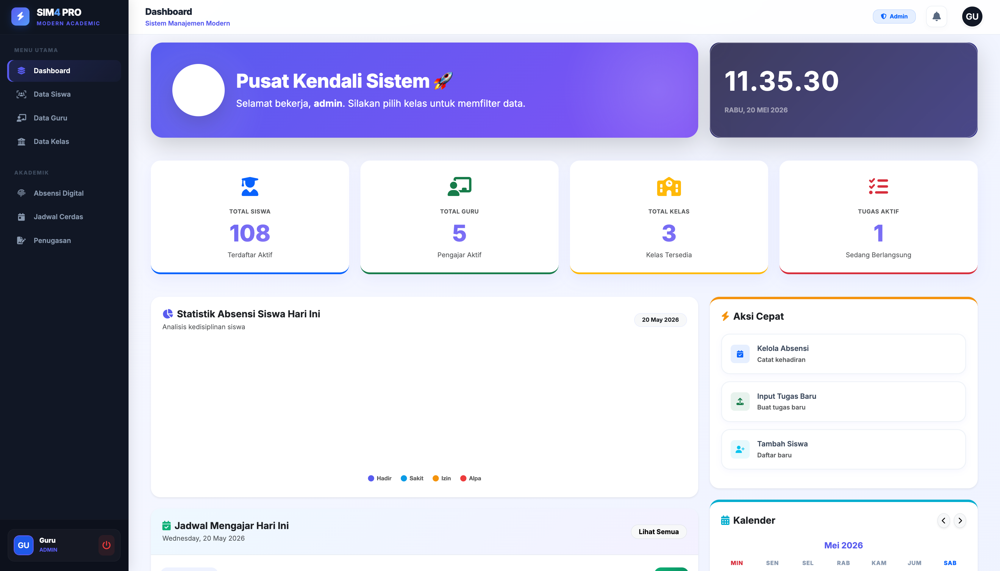
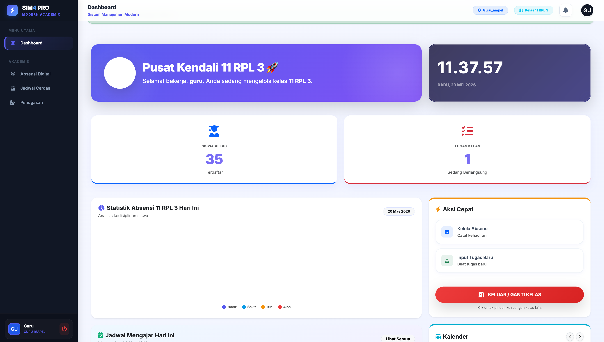
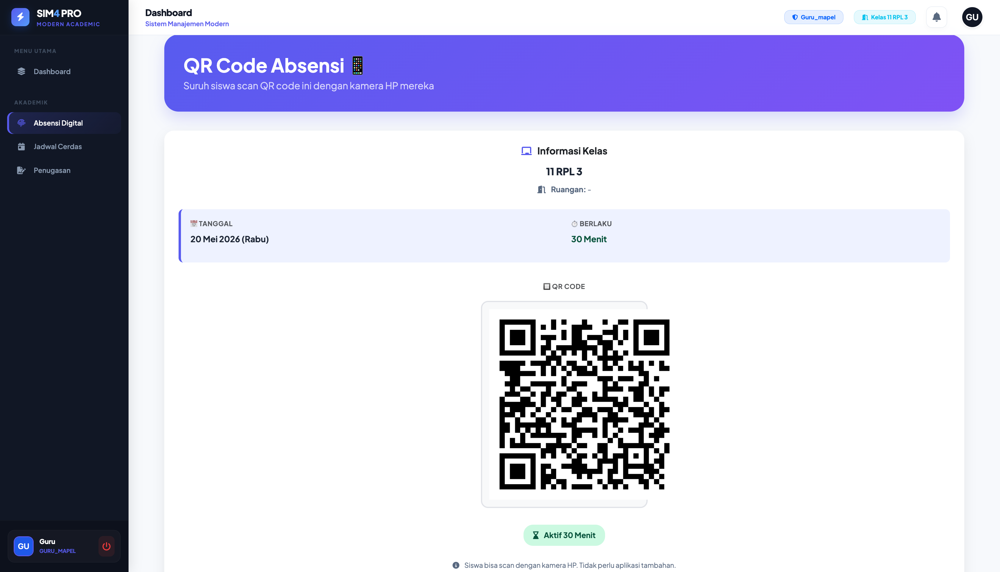
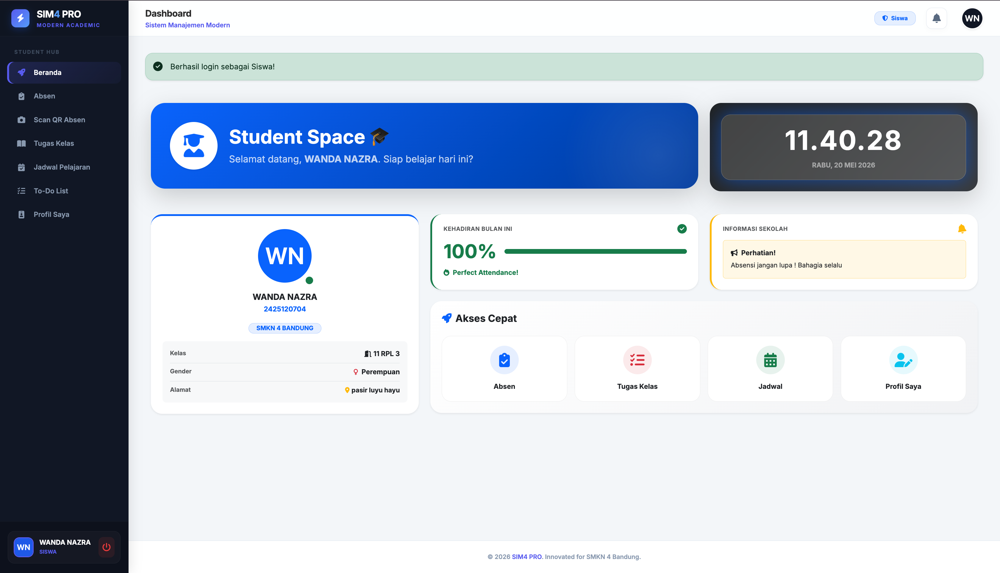

# SIM SEKOLAH SMKN 4 BANDUNG PRO

## 1. Deskripsi Proyek

**SIM SEKOLAH SMKN 4 BANDUNG PRO** adalah sebuah platform Sistem Informasi Manajemen (SIM) Sekolah berbasis web yang dirancang secara komprehensif untuk mendigitalisasi dan mengotomatisasi seluruh kegiatan operasional, belajar mengajar, serta administrasi harian di lingkungan sekolah.

Di era digital saat ini, pengelolaan data sekolah yang efektif membutuhkan kecepatan, akurasi, dan transparansi. Aplikasi ini dibangun untuk menjembatani komunikasi dan manajemen data antara pihak Administrasi (Sekolah), Tenaga Pendidik (Guru), dan Peserta Didik (Siswa) dalam satu ekosistem yang saling terintegrasi.

**Tujuan utama dari aplikasi ini meliputi:**

- **Sentralisasi Data**: Mengelola data siswa, guru, kelas, dan riwayat akademik dalam satu database yang aman dan mudah diakses.
- **Efisiensi Waktu**: Mengurangi beban administrasi manual guru, seperti mencatat kehadiran di kertas atau merekap nilai secara konvensional.
- **Inovasi Absensi**: Mengimplementasikan teknologi QR Code untuk absensi real-time yang modern, anti-kecurangan, dan efisien.
- **Kemandirian Siswa**: Memberikan akses kepada siswa untuk memantau jadwal, mengumpulkan tugas secara digital, dan mengatur jadwal belajar mereka sendiri melalui fitur manajemen tugas.

---

## 2. Fitur Utama

Sistem ini menggunakan arsitektur keamanan _Multi-Role Access Control_ di mana antarmuka dan fitur yang terbuka disesuaikan dengan siapa yang melakukan _login_.

### 👑 A. Modul Administrator (Super User)

Administrator adalah pengendali utama sistem dengan hak akses tak terbatas terhadap data master:

- **Manajemen Data Siswa (CRUD)**: Menambahkan, mengedit, menghapus, serta melihat rincian data seluruh siswa yang terdaftar.
- **Manajemen Data Guru (CRUD)**: Mengelola profil, hak akses (role), dan kredensial login bagi tenaga pendidik.
- **Manajemen Data Kelas (CRUD)**: Membuat daftar rombongan belajar (rombel) atau kelas beserta kapasitasnya.
- **Sistem Pelaporan Terpadu**: Fitur untuk melakukan _generate_ dan mencetak laporan resmi terkait data sekolah (seperti rekap guru dan siswa) yang dapat digunakan untuk akreditasi atau laporan tahunan.

### 👨‍🏫 B. Modul Guru (Wali Kelas & Guru Mapel)

Dirancang khusus untuk memfasilitasi kegiatan belajar mengajar secara interaktif:

- **Sistem Isolasi Ruang Kelas (Class Selection)**: Saat login, guru diwajibkan untuk "Memilih Kelas". Setelah itu, seluruh data yang muncul (statistik, tugas, absen) hanya berfokus pada kelas tersebut. Ini mencegah tumpang ditinggal data antar kelas.
- **Dashboard Statistik Cerdas**: Menampilkan grafik dan angka _real-time_ tentang jumlah siswa di kelas, persentase kehadiran hari ini (Hadir, Sakit, Izin, Alpa), serta ringkasan tugas aktif.
- **Manajemen Jadwal Mengajar**: Mengatur dan melihat jadwal mata pelajaran yang akan diajarkan.
- **Manajemen Penugasan & Penilaian Digital**: Guru dapat mengunggah instruksi tugas, memantau siapa saja siswa yang sudah mengumpulkan (upload file/link), lalu memberikan koreksi dan nilai secara langsung di dalam aplikasi.
- **Sistem Absensi Terintegrasi & QR Code Generator**:
    - _Manual Input_: Guru dapat mencentang kehadiran siswa satu per satu.
    - _QR Code Generation_: Guru dapat menghasilkan sebuah _barcode_ (QR Code) khusus untuk satu sesi kelas. Siswa tinggal melakukan proses _scan_ melalui HP mereka, dan otomatis akan terdata "Hadir".

### 👨‍🎓 C. Modul Siswa

Portal interaktif yang didesain agar siswa lebih bertanggung jawab atas kegiatan belajarnya:

- **Dashboard Akademik & Profil Pribadi**: Menampilkan data diri siswa secara lengkap dan metrik ringkas keseharian mereka.
- **Akses Jadwal Pelajaran**: Melihat daftar mata pelajaran yang harus diikuti sesuai harinya.
- **Pusat Pengumpulan Tugas (Assignment Center)**: Siswa dapat melihat tugas baru dari guru, membaca instruksi, dan melakukan _submit_ (pengumpulan tugas) secara _online_.
- **Scanner Kehadiran Mandiri**: Siswa memiliki fitur pemindai QR di dalam aplikasi mereka (bahkan rute scan ini bisa diakses secara publik) untuk merekam presensi di kelas.
- **To-Do List Pribadi Interaktif**: Fitur manajemen produktivitas di mana siswa dapat mencatat tugas pribadi, PR, atau kegiatan ekstrakurikuler, lalu mencentangnya (mark as done) jika sudah selesai.

---

## 3. Tech Stack & Arsitektur

Proyek ini dibangun menggunakan teknologi web modern untuk menjamin performa, keamanan, dan skalabilitas:

- **Backend Framework**: Laravel Framework v12.x (Menggunakan struktur MVC - Model View Controller yang kuat).
- **Bahasa Pemrograman**: PHP versi 8.2 atau lebih tinggi.
- **Frontend Engine**: Laravel Blade Templating Engine dikombinasikan dengan HTML5, CSS3, dan Vanilla JavaScript.
- **Asset Management**: Vite (Digunakan untuk _bundling_ file CSS dan JS secara cepat dan efisien).
- **Database System**: Mendukung MySQL (untuk _production_) atau SQLite (untuk _development_ ringan), dikonfigurasi melalui `.env`.
- **Ekstensi Pihak Ketiga (Packages)**:
    - `simplesoftwareio/simple-qrcode`: Generator engine utama untuk membuat gambar QR Code.
    - `endroid/qr-code`: Library dukungan tambahan untuk manipulasi barcode tingkat lanjut.

---

## 4. Vidio Demo

(public/images/Vidio Web.mov)

## 5. Screenshot Website

*(Pastikan file gambar sudah dimasukkan ke dalam folder `public/images/` proyek Laravel kamu dengan nama yang sesuai)*

- **Halaman Portal / Login Utama**:
  
- **Tampilan Dashboard Administrator**:
  
- **Tampilan Dashboard Guru (Statistik Kelas)**:
  
- **Sistem Generator & Scan QR Code**:
  
- **Tampilan Portal Siswa & To-Do List**:
  

---

## 5. Profil Tim Pengembang

Aplikasi ini dirancang dan dikembangkan dengan penuh dedikasi oleh kelompok kami:

1. **Raka Augusta Syabani** - NIS : 2425120700 — *Fullstack Developer (Backend & Frontend)*
2. **Reshad Azhar** - NIS : 2425120702 — *Frontend Developer*
3. **Wanda Nazra** - NIS : 2425120704 — *System Analyst*